# 🏗️ System Architecture

## Overview

The Multilingual Multi-Agent Support System is built using a modular, scalable architecture that combines multiple AI technologies to create an intelligent customer support platform. This document provides detailed technical information about the system's architecture, design patterns, and implementation details.

## 🎯 Core Design Principles

### 1. **Modularity**
- Each agent is independently deployable and scalable
- Clear separation of concerns between components
- Pluggable processors for different document formats
- Configurable agent behaviors and parameters

### 2. **Local-First Privacy**
- All LLM inference runs locally via Ollama
- No external API dependencies for core functionality
- Optional translation services can be disabled
- Complete data sovereignty

### 3. **Multi-Agent Coordination**
- Asynchronous message passing between agents
- Symbolic communication protocols learned via RL
- Emergent coordination behaviors
- Fault-tolerant agent communication

### 4. **Multilingual Support**
- Language detection at message level
- Multilingual embeddings for semantic search
- Translation services for cross-language understanding
- Language-specific text processing pipelines

## 🏛️ High-Level Architecture

```mermaid
graph TB
    subgraph "🖥️ User Interface Layer"
        UI[Streamlit Dashboard]
        API[FastAPI Backend]
        CLI[CLI Interface]
    end
    
    subgraph "🤖 Agent Layer"
        AC[Agent Coordinator]
        CA[Communication Agent]
        RA[Retrieval Agent]
        CR[Critic Agent]
        EA[Escalation Agent]
    end
    
    subgraph "🧠 AI/ML Layer"
        RL[RL Training System]
        EMB[Embedding Models]
        LLM[Local LLM (Ollama)]
        NLP[Language Processing]
    end
    
    subgraph "📚 Knowledge Layer"
        KB[Knowledge Base]
        VI[Vector Index]
        DP[Document Processors]
        META[Metadata Store]
    end
    
    subgraph "💾 Storage Layer"
        FS[File System]
        DB[SQLite/PostgreSQL]
        CACHE[Redis Cache]
        LOGS[Log Files]
    end
    
    subgraph "🔧 Infrastructure Layer"
        CONFIG[Configuration]
        MONITOR[Monitoring]
        EMAIL[SMTP Service]
        SECURITY[Security Layer]
    end
    
    UI --> AC
    API --> AC
    CLI --> AC
    
    AC --> CA
    AC --> RA
    AC --> CR
    AC --> EA
    
    CA --> RL
    CA --> EMB
    RA --> KB
    RA --> EMB
    CR --> NLP
    EA --> EMAIL
    
    KB --> VI
    KB --> DP
    KB --> META
    
    VI --> FS
    META --> DB
    DP --> FS
    
    CONFIG --> AC
    MONITOR --> LOGS
    SECURITY --> DB
```

## 🤖 Agent Architecture

### Agent Base Class

All agents inherit from `BaseAgent` which provides:

```python
class BaseAgent(ABC):
    def __init__(self, agent_id: str, config: Dict[str, Any])
    
    @abstractmethod
    async def process_message(self, message: Message) -> Optional[Message]
    
    @abstractmethod
    def get_capabilities(self) -> List[str]
    
    # Common functionality
    def send_message(self, recipient: str, content: str, ...)
    def receive_message(self, message: Message)
    async def run_cycle(self) -> List[Message]
    def get_stats(self) -> Dict[str, Any]
```

### Message Protocol

Inter-agent communication uses a structured message format:

```python
@dataclass
class Message:
    id: str
    type: MessageType  # QUERY, RESPONSE, SYMBOLIC, ERROR, ESCALATION, FEEDBACK
    content: str
    symbolic_encoding: Optional[List[int]]
    metadata: Dict[str, Any]
    sender: str
    recipient: str
    timestamp: str
    language: str
```

### Agent Coordination

The `AgentCoordinator` manages agent lifecycle and message routing:

```python
class AgentCoordinator:
    def register_agent(self, agent: BaseAgent)
    async def run_cycle(self)
    async def _route_message(self, message: Message)
    def get_system_stats(self) -> Dict[str, Any]
```

## 🧠 Communication Agent Architecture

### Neural Network Structure

The Communication Agent uses a neural network to encode text into symbolic representations:

```python
class SymbolicEncoder(nn.Module):
    def __init__(self, vocab_size=1000, embedding_dim=256, hidden_dim=512):
        # Text encoder (MLP/Transformer)
        self.text_encoder = nn.Sequential(...)
        
        # Symbolic message generator
        self.message_generator = nn.Sequential(...)
    
    def forward(self, text_embedding: torch.Tensor) -> torch.Tensor:
        # Returns symbolic message logits
```

### Reinforcement Learning Integration

The agent learns optimal encoding strategies using REINFORCE:

```python
class REINFORCETrainer:
    def __init__(self, policy_network: nn.Module)
    
    def start_episode(self)
    def add_step(self, state, action, reward, log_prob)
    def end_episode(self) -> TrainingStats
    
    def _calculate_returns(self, rewards: List[float]) -> torch.Tensor
    def _update_policy(self, returns, log_probs) -> Tuple[float, float]
```

### Symbolic Vocabulary

The agent develops a learned vocabulary of symbolic representations:

```python
@dataclass
class SymbolicMessage:
    encoding: List[int]          # Symbolic representation
    original_text: str           # Original text
    language: str               # Detected language
    confidence: float           # Encoding confidence
    metadata: Dict[str, Any]    # Additional context
```

## 🔍 Retrieval Agent Architecture

### Search Pipeline

The Retrieval Agent implements a multi-stage search pipeline:

1. **Query Processing**
   - Language detection
   - Translation (if needed)
   - Text preprocessing and normalization

2. **Vector Search**
   - Query embedding generation
   - FAISS similarity search
   - Initial result ranking

3. **Re-ranking**
   - Term overlap analysis
   - Relevance indicator extraction
   - Composite scoring

4. **Result Processing**
   - Context extraction
   - Metadata enrichment
   - Response formatting

### Knowledge Base Integration

```python
class RetrievalAgent(BaseAgent):
    def __init__(self):
        self.knowledge_base = get_knowledge_base()
        self.query_cache = {}
        self.symbolic_query_cache = {}
    
    async def _search_knowledge_base(self, query: str) -> List[SearchResult]
    def _process_search_results(self, results: List[SearchResult]) -> List[Dict]
    def _interpret_symbolic_encoding(self, encoding: List[int]) -> str
```

## 📚 Knowledge Base Architecture

### Document Processing Pipeline


### Processor Architecture

Each document format has a specialized processor:

```python
class BaseDocumentProcessor(ABC):
    @abstractmethod
    def can_process(self, file_path: str) -> bool
    
    @abstractmethod
    def extract_text(self, file_path: str) -> str
    
    @abstractmethod
    def extract_metadata(self, file_path: str) -> Dict[str, Any]
    
    def process_document(self, file_path: str) -> ProcessingResult
    def _create_chunks(self, text: str, ...) -> List[DocumentChunk]
```

### Vector Storage

The system uses FAISS for efficient similarity search:

```python
class UnifiedKnowledgeBase:
    def __init__(self):
        self.vector_index = faiss.IndexFlatIP(embedding_dimension)
        self.chunks: List[DocumentChunk] = []
        self.embedding_model = SentenceTransformer(...)
    
    def search(self, query: str, ...) -> List[SearchResult]
    def add_document(self, file_path: str) -> bool
    def _generate_embedding(self, text: str) -> np.ndarray
```

## 📊 Critic Agent Architecture

### Multi-Criteria Evaluation

The Critic Agent evaluates responses across multiple dimensions:

```python
@dataclass
class EvaluationCriteria:
    relevance_weight: float = 0.4
    accuracy_weight: float = 0.3
    completeness_weight: float = 0.2
    language_quality_weight: float = 0.1

class CriticAgent(BaseAgent):
    def _evaluate_relevance(self, content: str, context: Dict) -> float
    def _evaluate_accuracy(self, content: str, context: Dict) -> float
    def _evaluate_completeness(self, content: str, context: Dict) -> float
    def _evaluate_language_quality(self, content: str, language: str) -> float
```

### Reward Signal Generation

The agent provides structured feedback for RL training:

```python
@dataclass
class EvaluationResult:
    overall_score: float
    relevance_score: float
    accuracy_score: float
    completeness_score: float
    language_quality_score: float
    feedback: str
    detailed_analysis: Dict[str, Any]
```

## ⚠️ Escalation Agent Architecture

### Severity Assessment

The Escalation Agent uses pattern-based analysis for severity detection:

```python
class EscalationAgent(BaseAgent):
    def __init__(self):
        self.high_severity_keywords = [...]
        self.urgency_patterns = {
            'time_sensitive': [...],
            'business_critical': [...],
            'security_related': [...],
            'legal_compliance': [...]
        }
    
    async def _assess_severity(self, message: Message) -> SeverityAssessment
    def _check_urgency_patterns(self, content: str) -> List[str]
    async def _handle_escalation(self, message: Message, assessment: SeverityAssessment)
```

### Email Notification System

```python
@dataclass
class EscalationRecord:
    escalation_id: str
    original_message_id: str
    severity_assessment: SeverityAssessment
    escalation_timestamp: str
    email_sent: bool
    email_recipients: List[str]
    resolution_deadline: Optional[str]

async def _send_escalation_email(self, record: EscalationRecord) -> bool
```

## 🎯 Reinforcement Learning Architecture

### Training Environment

The RL environment simulates the support system for training:

```python
class SupportEnvironment:
    def reset(self, task: Optional[SupportTask] = None) -> Dict[str, Any]
    async def step(self, action: Optional[Dict] = None) -> Tuple[Dict, float, bool, Dict]
    
    def _calculate_reward(self) -> float
    def _is_episode_done(self) -> bool
    def _get_observation(self) -> Dict[str, Any]
```

### Task Generation

Diverse training tasks are generated across multiple categories:

```python
class SupportTaskGenerator:
    def __init__(self):
        self.task_templates = {
            TaskType.IT_SUPPORT: [...],
            TaskType.HR_INQUIRY: [...],
            TaskType.TECHNICAL_ISSUE: [...],
            # ...
        }
    
    def generate_task(self, task_type: Optional[TaskType] = None) -> SupportTask
```

## 🌐 Multilingual Processing

### Language Detection Pipeline

```python
class LanguageDetector:
    def detect_language(self, text: str) -> LanguageDetectionResult
    def _clean_text_for_detection(self, text: str) -> str
    def _calculate_confidence(self, text: str, detected_lang: str) -> float
```

### Translation System

```python
class MultilingualTranslator:
    def translate_text(self, text: str, target_language: str, source_language: str) -> TranslationResult
    def _translation_cache: Dict[str, TranslationResult]
```

### Text Preprocessing

```python
class TextPreprocessor:
    def preprocess_text(self, text: str, language: str, ...) -> str
    def _get_stopwords(self, language: str) -> set
    def _get_stemmer(self, language: str) -> Optional[SnowballStemmer]
```

## 💾 Data Flow Architecture

### Message Flow

1. **User Query** → Communication Agent
2. **Symbolic Encoding** → Retrieval Agent
3. **Knowledge Search** → Search Results
4. **Response Generation** → Critic Agent
5. **Evaluation** → Reward Signal
6. **RL Update** → Policy Improvement

### Data Storage


## 🔧 Configuration Architecture

### Hierarchical Configuration

```yaml
# system_config.yaml
system:
  name: "NexaCorp AI Support System"
  environment: "local"  # local, development, production

agents:
  communication:
    symbolic_vocab_size: 1000
    learning_rate: 0.001
  
  retrieval:
    max_documents: 20
    rerank_threshold: 0.8

knowledge_base:
  vector_db: "faiss"
  similarity_threshold: 0.75
  embedding_model: "sentence-transformers/paraphrase-multilingual-MiniLM-L12-v2"

reinforcement_learning:
  algorithm: "REINFORCE"
  training:
    episodes: 1000
    learning_rate: 0.0003
    gamma: 0.99
```

### Environment Variable Override

```python
class ConfigLoader:
    def _apply_env_overrides(self, config_data: Dict[str, Any]):
        env_mappings = {
            "NEXACORP_DEBUG": "system.debug",
            "NEXACORP_OLLAMA_URL": "llm.ollama.base_url",
            # ...
        }
```

## 🚀 Deployment Architecture

### Single-Node Deployment

```mermaid
graph TB
    subgraph "🖥️ Single Node"
        UI[Streamlit UI :8501]
        API[FastAPI :8000]
        AGENTS[Agent Processes]
        OLLAMA[Ollama :11434]
        DB[SQLite DB]
        FILES[File Storage]
    end
    
    USER[Users] --> UI
    USER --> API
    UI --> AGENTS
    API --> AGENTS
    AGENTS --> OLLAMA
    AGENTS --> DB
    AGENTS --> FILES
```



### Multi-Node Deployment

```mermaid
graph TB
    subgraph "🌐 Load Balancer"
        LB[nginx/HAProxy]
    end
    
    subgraph "🖥️ UI Nodes"
        UI1[Streamlit 1]
        UI2[Streamlit 2]
    end
    
    subgraph "⚙️ API Nodes"
        API1[FastAPI 1]
        API2[FastAPI 2]
    end
    
    subgraph "🤖 Agent Cluster"
        COORD[Agent Coordinator]
        AGENTS[Agent Pool]
    end
    
    subgraph "🧠 AI Services"
        OLLAMA[Ollama Cluster]
        EMB[Embedding Service]
    end
    
    subgraph "💾 Data Layer"
        POSTGRES[PostgreSQL]
        REDIS[Redis Cache]
        S3[Object Storage]
    end
    
    LB --> UI1
    LB --> UI2
    LB --> API1
    LB --> API2
    
    UI1 --> COORD
    UI2 --> COORD
    API1 --> COORD
    API2 --> COORD
    
    COORD --> AGENTS
    AGENTS --> OLLAMA
    AGENTS --> EMB
    AGENTS --> POSTGRES
    AGENTS --> REDIS
    AGENTS --> S3
```



## 🔒 Security Architecture

### Authentication & Authorization

```python
class SecurityManager:
    def authenticate_user(self, credentials: Dict) -> Optional[User]
    def authorize_action(self, user: User, action: str, resource: str) -> bool
    def encrypt_sensitive_data(self, data: str) -> str
    def audit_log(self, user: User, action: str, details: Dict)
```

### Data Protection

- **Encryption at Rest**: Sensitive configuration and user data
- **Encryption in Transit**: TLS for all network communication
- **Access Controls**: Role-based permissions for system operations
- **Audit Logging**: Comprehensive logging of security events

## 📊 Monitoring Architecture

### Metrics Collection

```python
class MetricsCollector:
    def record_agent_performance(self, agent_id: str, metrics: Dict)
    def record_query_latency(self, query_id: str, latency: float)
    def record_system_health(self, component: str, status: str)
    def record_user_interaction(self, session_id: str, action: str)
```

### Health Checks

```python
class HealthChecker:
    def check_agent_health(self, agent_id: str) -> HealthStatus
    def check_knowledge_base_health(self) -> HealthStatus
    def check_external_services(self) -> Dict[str, HealthStatus]
    def get_system_status(self) -> SystemStatus
```

## 🔄 Event-Driven Architecture

### Event System

```python
class EventBus:
    def publish(self, event: Event)
    def subscribe(self, event_type: str, handler: Callable)
    def unsubscribe(self, event_type: str, handler: Callable)

@dataclass
class Event:
    type: str
    source: str
    timestamp: datetime
    data: Dict[str, Any]
```

### Event Types

- **Agent Events**: `agent.started`, `agent.stopped`, `agent.error`
- **Message Events**: `message.sent`, `message.received`, `message.processed`
- **Training Events**: `episode.started`, `episode.completed`, `model.updated`
- **System Events**: `system.startup`, `system.shutdown`, `config.updated`

This architecture provides a robust, scalable foundation for the multilingual multi-agent support system, enabling advanced AI capabilities while maintaining security, performance, and maintainability.